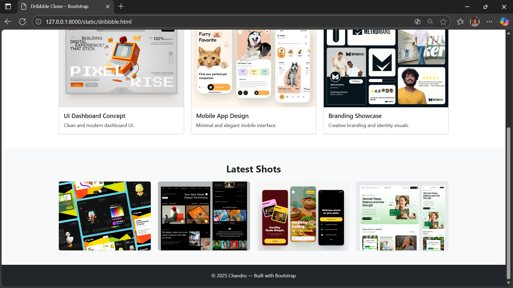

# Project Responsive Web Design using Bootstrap
## Date: 15.11.2025

## AIM:
To create a simplified clone of Dribbble (https://dribbble.com/) landing page.


## DESIGN STEPS:

### Step 1:
Clone the repository from GitHub.

### Step 2:
Create Django Admin project.

### Step 3:
Create a New App under the Django Admin project.

### Step 4:
Insert the necessary CSS and JavaScript files as external in order to use Bootstrap.

### Step 5:
Create a HTML file and include the needed Bootstrap components.

### Step 6:
Publish the website in the LocalHost.

## PROGRAM :

```html
<!DOCTYPE html>
<html lang="en">
<head>
  <meta charset="UTF-8" />
  <meta name="viewport" content="width=device-width, initial-scale=1.0" />
  <title>Dribbble Clone – Bootstrap</title>
  <link href="https://cdn.jsdelivr.net/npm/bootstrap@5.3.2/dist/css/bootstrap.min.css" rel="stylesheet" />
</head>
<body>
  <!-- Navigation Bar -->
  <nav class="navbar navbar-expand-lg bg-white shadow-sm py-3">
    <div class="container">
      <a class="navbar-brand fw-bold" href="#">DribClone</a>
      <button class="navbar-toggler" type="button" data-bs-toggle="collapse" data-bs-target="#navMenu">
        <span class="navbar-toggler-icon"></span>
      </button>

      <div class="collapse navbar-collapse" id="navMenu">
        <ul class="navbar-nav ms-auto mb-2 mb-lg-0">
          <li class="nav-item"><a class="nav-link" href="#popular">Popular</a></li>
          <li class="nav-item"><a class="nav-link" href="#shots">Shots</a></li>
          <li class="nav-item"><a class="nav-link" href="#footer">Contact</a></li>
        </ul>
      </div>
    </div>
  </nav>

  <!-- Hero Section -->
  <section class="py-5 text-center bg-light">
    <div class="container">
      <h1 class="display-4 fw-bold">Explore the World’s Top Creative Designs</h1>
      <p class="lead mt-3">A simple Bootstrap-based Dribbble-style landing page.</p>
      <a class="btn btn-primary px-4 py-2 mt-2" href="#popular">Explore Shots</a>
    </div>
  </section>

  <!-- Popular Shots Section -->
  <section id="popular" class="py-5">
    <div class="container">
      <h2 class="fw-bold text-center mb-4">Popular Shots</h2>
      <div class="row g-4">
        <div class="col-md-4">
          <div class="card shadow-sm">
            
            <div class="card-body">
              <h5 class="card-title">UI Dashboard Concept</h5>
              <p class="card-text">Clean and modern dashboard UI.</p>
            </div>
          </div>
        </div>

        <div class="col-md-4">
          <div class="card shadow-sm">
            
            <div class="card-body">
              <h5 class="card-title">Mobile App Design</h5>
              <p class="card-text">Minimal and elegant mobile interface.</p>
            </div>
          </div>
        </div>

        <div class="col-md-4">
          <div class="card shadow-sm">
            
            <div class="card-body">
              <h5 class="card-title">Branding Showcase</h5>
              <p class="card-text">Creative branding and identity visuals.</p>
            </div>
          </div>
        </div>
      </div>
    </div>
  </section>

  <!-- Shot Grid Section -->
  <section id="shots" class="py-5 bg-light">
    <div class="container">
      <h2 class="fw-bold text-center mb-4">Latest Shots</h2>
      <div class="row g-4">
        <div class="col-md-3"></div>
        <div class="col-md-3"></div>
        <div class="col-md-3"></div>
        <div class="col-md-3"></div>
      </div>
    </div>
  </section>

  <!-- Footer -->
  <footer id="footer" class="bg-dark text-white text-center py-4">
    <p class="mb-0">© 2025 Chandru — Built with Bootstrap</p>
  </footer>

  <script src="https://cdn.jsdelivr.net/npm/bootstrap@5.3.2/dist/js/bootstrap.bundle.min.js"></script>
</body>
</html>

```

## OUTPUT:


## RESULT:
The Project for responsive web design using Bootstrap is completed successfully.
